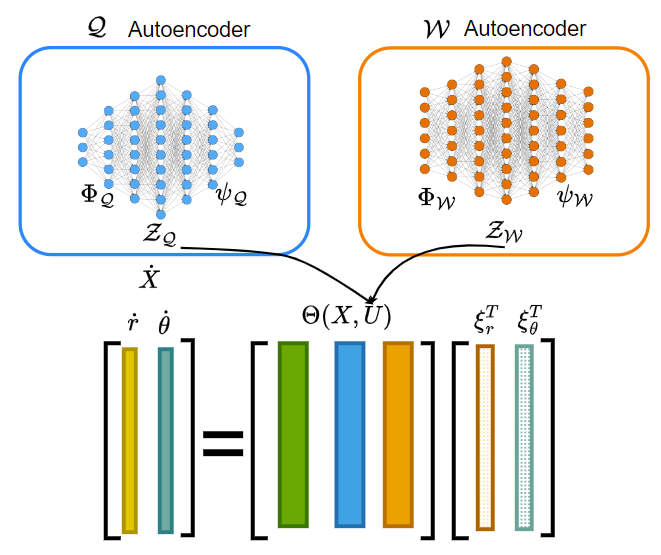
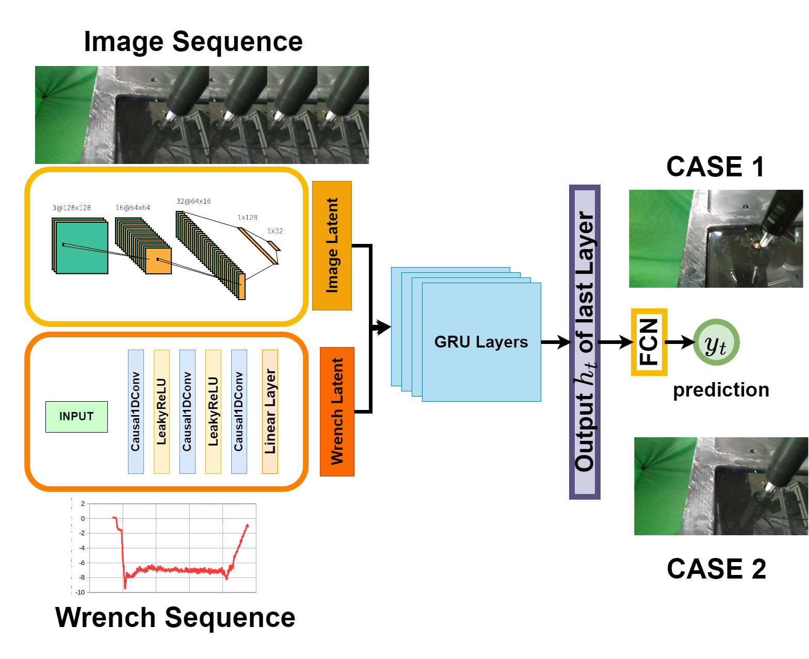

# PhysicsInformedScrewDriving

This repository is the official implementation of [Physics-Informed Learning to Enable Robotic Screw-Driving Under Hole Pose Uncertainties](https://sites.google.com/usc.edu/physicsinformedscrewdriving/home).

This code is intended for reproduction purposes only. Current implementation does not support extensions.
The objective of this repository is to provide the reader with the implementation details of the learning framework proposed in the IROS 2023 paper.


</img>

## Requirements

To install requirements, create a virtual environment:

```
python -m venv physicsinformed-screw
source physicsinformed-screw/bin/activate
```

Then in the respository run:
```setup
pip install -e .
```

## Dataset and configs
>The example dataset can be downloaded from the following link
```download dataset
gdown -id 1vd4qKbVVS16ymHH4h3RC8x2uIXhlQYtr
````
This will have two datasets. One for screw dynamics model training and another one for failure_mode_detection.
If the above command doesn't work due to file size issue, kindly use the following google drive link:
[https://drive.google.com/drive/folders/1vd4qKbVVS16ymHH4h3RC8x2uIXhlQYtr](https://drive.google.com/drive/folders/1vd4qKbVVS16ymHH4h3RC8x2uIXhlQYtr?usp=sharing)

<span style="color:red">!!</span> Once the datasets are downloaded, make sure to store them in "dataset" folders in screw-model and failure_mode_detection folders. Both the datasets are further segregated into train, dev and test.

We have also provided config files consisting of the necessary hyperparameters for training the three models in the "config" folder inside each of the model subdirectory.

## Training and Evaluation

### Screw-Model (SinDy Model and Mean Motion Model)
</img>

#### SinDy Model Training
Once the dataset is placed in the appropriate "dataset" directory. The run the following scripts

```training sindy
python train_sindy_model.py -f sindy_training_params.json
```
Once you run this for enough epochs, in the end, plots of the screw motion will be generated.
These plots show the performance of the SinDy model in capturing the screw-tip's fine-grained dynamics.


#### Screw Mean Motion Model Training
```training screw mean model
python train_mean_model.py -f screw_mean_training_params.json
```


### Failure Mode Detection Model
</img>

```training failure mode detection model
python train.py -f training_params.json
```

The confusion matrix with the appropriate prediction will be displayed in the end as a result

## Results
The trained model checkpoints will be generated in the models directory inside the corresponding folders.

## Reference

```
@INPROCEEDINGS{manyar_iros_2023,
  author={Manyar, Omey M. and Narayan, Santosh V and Lengade, Rohin and Gupta, Satyandra K.},
  booktitle={2023 IEEE/RSJ International Conference on Intelligent Robots and Systems (IROS)}, 
  title={Physics-Informed Learning to Enable Robotic Screw-Driving Under Hole Pose Uncertainties}, 
  year={2023},
  volume={},
  number={},
  pages={2993-3000},
  keywords={Uncertainty;Service robots;Position control;Fasteners;Predictive models;Manipulators;Impedance},
  doi={10.1109/IROS55552.2023.10342151}}

```